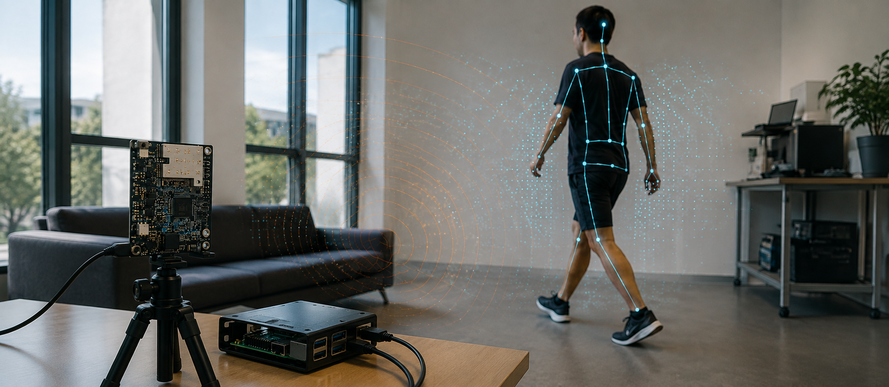

# Agile-MmWave-Hpe

Physics-guided mmWave preprocessing for agile human pose estimation, implementing the paper's deterministic **SSP**, **MCP**, and **HMSF** front end followed by its lightweight **PRN** regressor.

<div align="center">

# Agile mmWave HPE

### Physics-guided preprocessing for practical, privacy-preserving 3D human pose estimation

[](https://arxiv.org/abs/2603.08236)
[](https://www.python.org/)
[](https://pytorch.org/)
[](https://onnxruntime.ai/)

**Why learn what radar physics already knows?**

*Replace oversized learned radar front ends with deterministic spatial and motion priors, then recover 3D pose with a compact regressor.*

</div>

<!--
Hero image placeholder: after generating the image described in assets/IMAGE_PROMPT.md,
save it as assets/hero-mmwave-pose.jpg and uncomment the block below.

<p align="center">
  
</p>
-->

<p align="center">
  
</p>

## Why This Matters

mmWave radar can sense human structure and motion without cameras, preserving privacy and remaining robust when light is poor. Yet many radar pose-estimation systems discard these physical cues behind large learned front ends, making them difficult to deploy where they matter most: on low-power, always-on devices.

This project turns the range-angle-Doppler (RAD) cube into a human-centric descriptor using deterministic operations grounded in radar sensing and human kinematics. The result is not merely a smaller network: it is a route from laboratory-scale radar HPE to real edge deployment.

| On the HuPR benchmark | Our physics-guided pipeline |
|---|---:|
| Trainable parameters | **5.1M** |
| MAJPE | **64.16 mm** |
| PA-MAJPE | **60.29 mm** |
| Raspberry Pi 5 throughput | **18.2 FPS** |
| Raspberry Pi 5 peak runtime memory | **7.3 MB** |

The paper reports a **55.7-88.9% parameter reduction** relative to representative mmWave HPE baselines while retaining competitive accuracy.

## Core Idea


1. **Spatial Structure Preservation (SSP):** selects the anthropometrically plausible range-angle region and suppresses background returns.
2. **Motion Continuity Preservation (MCP):** extracts the dominant Doppler velocity at each spatial cell, then keeps locally consistent human motion.
3. **Hierarchical Multi-Scale Fusion (HMSF):** fuses coarse, medium, and fine RAD features aligned with torso, limb, and joint scales.
4. **Pose Regression Network (PRN):** maps pooled physics-guided features and global motion descriptors to 17 three-dimensional joints.

The front end contains **no learnable parameters**. Its interpretable thresholds and pooling scales provide runtime adaptability without changing the PRN weights.

## Paper-To-Code Map

| Paper module | Source | Exact role |
|---|---|---|
| SSP, Eq. (1)-(2) | `models/physics.py` | Range-angle anthropometric mask, broadcast across Doppler. |
| MCP, Eq. (3)-(7) | `models/physics.py` | Dominant velocity, local mean/variance consistency, global motion descriptors. |
| HMSF, Eq. (8)-(9) | `models/physics.py` | Three-scale 3D average pooling, trilinear restoration, concatenation. |
| PRN, Eq. (10)-(12) | `models/pose_regressor.py` | Global descriptor to 17-joint 3D pose through a two-ReLU-layer MLP. |

## Quick Start

### 1. Install

```bash
pip install -r requirements.txt
```

### 2. Prepare HuPR

Download HuPR, preserve its official train/validation/test split, and follow [data/README.md](data/README.md). The canonical format is a paired RAD tensor and 3D joint array per split:

```text
data/HuPR/
  train.npz    # rad [N, 64, 64, 16], joints [N, 17, 3]
  val.npz
  test.npz
```

Complex RAD cubes are accepted and converted to reflection magnitude during loading. Axis order must remain **range, angle, Doppler**.

### 3. Train And Evaluate

```bash
python train.py --config configs/balanced.yaml
python evaluate.py --config configs/balanced.yaml --checkpoint checkpoints/balanced.pth
```

### 4. Export For Edge Inference

```bash
python export_onnx.py --checkpoint checkpoints/balanced.pth --output balanced.onnx
python deploy/run_rpi.py --model balanced.onnx --rad frame.npy
```

See [deploy/README.md](deploy/README.md) for the Raspberry Pi input contract.

## Runtime Profiles

The five provided configurations expose the paper's deployment-time controls: range-angle ROI, Doppler and variance thresholds, local-consistency window, and two pooling scales.

| Profile | Primary intent | Configuration |
|---|---|---|
| Ultra-Light | Maximum throughput | `configs/ultra_light.yaml` |
| Light | Low-resource inference | `configs/light.yaml` |
| Balanced | Accuracy-efficiency trade-off | `configs/balanced.yaml` |
| High-Precision | Greater feature detail | `configs/high_precision.yaml` |
| Ultra-Precision | Highest retained spatial detail | `configs/ultra_precision.yaml` |

## Reproducibility

```bash
python -m pytest tests
```

The test suite covers deterministic front-end behavior, model tensor shapes, a train/evaluate checkpoint round trip, and ONNX export using synthetic RAD data.

## Citation

```bibtex
@article{zheng2026learn,
  title={Why Learn What Physics Already Knows? Realizing Agile mmWave-based Human Pose Estimation via Physics-Guided Preprocessing},
  author={Zheng, Shuntian and Li, Jiaqi and Ni, Minzhe and Lu, Xiaoman and Guan, Yu},
  journal={arXiv preprint arXiv:2603.08236},
  year={2026}
}
```
